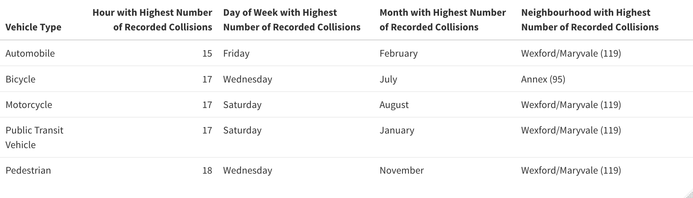
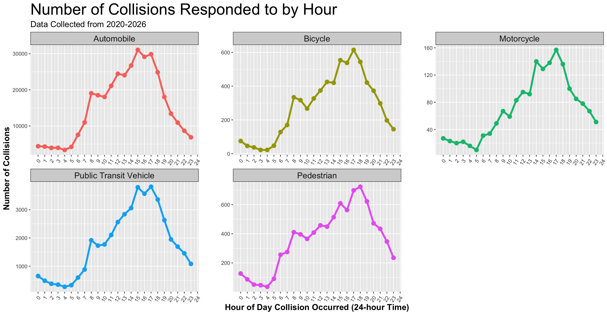
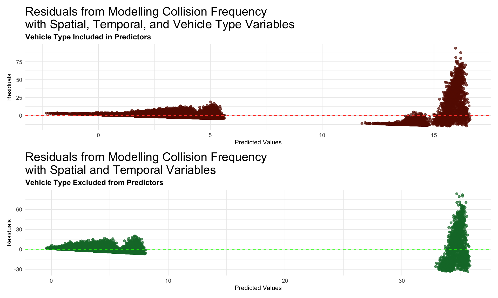

\newpage

# Abstract

This study analyzes Toronto Police Service (TPS) collision data to identify temporal and spatial patterns across five travel modes—automobiles, bicycles, motorcycles, public transit, and pedestrians. The dataset that includes only police reported incidents was cleaned in R to conduct temporal and vehicle type analysis with consistency. EDA show clear daily peaks during morning and afternoon rush hours, along with differences between weekday and weekends, The EDA also opposes seasonal trends between year round and warm weather travel modes. Linear regression models reveal that vehicle type is not a strong predictor, while temporal and spatial variables explain some variation in collision frequency. Limitations include missing location data and underrepresentation of non automobile collisions. The results highlight predictable collision hotspots and suggest future work incorporating richer spatial data and severity metrics to strengthen modeling and inform safety interventions.

# Introduction

As the economy in Toronto grows, it is significant to improve the efficiency and effectiveness of infrastructure to support the robust growth of the society; in which topic, the traffic system stands out. The foundation of a efficient traffic system is the safety of all residence involved, This study adopts a data-driven approach onto the latest traffic collision dataset from the Toronto Police Service (TPS). The dataset provides detailed collision records for the analysis of temporal and spatial patterns across different modes of travel. We will examine whether collision trends in Toronto are consistent with findings from previous research on high-risk travel periods and identify neighborhoods with elevated collision risks for different travel modes.

# Relevant Literature

Scholars worldwide focus on designing the most suitable system starting from investigating the spots with most collisions in their region. Study on Wujiang, China [@cite-wujiang] used a 3D model to map the data from 2016, and they found the trend between geometrical spot and the crash hotspots for resource allocation from local government. Scientists in Iran [@cite-forecast] conducted a time series analysis in Zanjan Province for predicting the future morality in traffic, and the models shows a descending trend in traffic morality, associated with stricter traffic enforcement and education as time passed. When we put our attention back to Toronto, there are also different factors affecting the collision rate over time. [@cite-covid] During the strategic promotion of remote work, the collision rate dropped dramatically, meanwhile it kept dropping even if the government “re-opened” onsite works.

# Dataset & Methods

## Data Source

The Toronto Police Service (TPS) maintains a Public Safety Data Portal, where they regularly publish and update crime statistics datasets for the Greater Toronto Area. The data used in this analysis is the Traffic Collisions Open Data (ASR-T-TBL-001) dataset, obtained from [@cite-tpsdata] and licensed under the Open Government Licence – Ontario. It was downloaded on Wednesday, June 17, 2026 at 7:57PM, and covers collisions responded to by TPS from January 1, 2020 through to March 31, 2026. A notable limitation is that only collisions where TPS were called to the scene are included in this dataset - if for any reason, the involved parties made a decision to not involve the police, their collision statistics will not be reported here.

## Data Structure & Key Variables

Per [@cite-tpsdata], each row/observation in this dataset represents a single collision, and the columns/variables use identification variables to describe each collision in three ways: 1) where and when the collision occurred, 2) whether there were injuries, deaths, or property damage, and whether parties failed to remain at the scene, and 3) which types of vehicles were involved in the collision. To answer the question of where the highest risk of traffic collision for various modes of transportation is in the Greater Toronto Area, our primary variables of interest are the spatial and temporal variables (to determine where and when the most accidents occur), and the information about involved vehicles (to determine any diverging trends between modes of transportation).

## Data Preparation: Cleaning & Pre-Processing

The raw data as obtained from [@cite-tpsdata] was cleaned in a variety of ways before analysis. This cleaning was done using using the programming language R [@cite-R] due to its powerful statistical and data-focused capabilities. To improve readability and minimize errors, several columns were renamed using more semantic language. As an example, the column "FTR_COLLISIONS," which contains information about whether one or more parties failed to remain at the collision site, was renamed to "FAILURE_TO_REMAIN," so this meaning is more plainly understandable. After renaming select columns, all columns were standardized to snake_case using the janitor library [@cite-janitor] to further improve consistency and cleanliness in the working data. Finally, two new columns were added to make statistical visualizations easier to generate for ordered temporal variables: a column named "occ_month_num" to represent the month names for each collision os numbers from 1-12 (January = 1, June = 6, etc.), and a similar column named "occ_month_dow" to represent the days of the week for each collision as numbers from 1-7 (Sunday = 1, Wednesday = 4, etc.).

## Exploratory Data Analysis

Initial exploratory data analysis (EDA) was done in R [@cite-R] making heavy use of the Tidyverse library [@cite-tidyverse], with the goal of uncovering high-level trends and possible variables of interest for further analysis. To improve reproducibility, all filepaths were made relative using the Here package [@cite-here], and project contents were regularly committed to GitHub for granular version control.

The first EDA step was simply looking at the temporal and spatial data, to make sure that there were no obvious encoding errors, and that the values in our key variable columns made sense. This was done using R's unique() function on the columns *occ_hour* (hour the collision occured), *occ_dow* (day of the week the collision occurred), *occ_month* (month the collision occurred), and *neighbourhood* (Toronto neighbourhood where the collision occurred). While all the values in the temporal columns were encoded consistently and correctly, this did reveal that the *neighbourhood* column had an "NSA" value, representing a collision where no location was recorded. Using group_by() and mutate() to calculate the percentage of total collisions which occurred in each neighbourhood revealed that 17% of collisions did not have location data recorded. While this does not make reporting or statistical modelling impossible for spatial data, this is a limitation of the data, and it is worth noting that our conclusions may not be as reflective of our target population as they would have without this missing data.

Since the second part of our research question involves how spatial and temporal trends in collision frequency might change depending on mode of transportation, it was also important to look at the vehicle data available, to understand how it might be used and make sure there were no encoding errors. In the original dataframe, the five vehicle types *(automobile, bicycle, motorcycle, passenger (public transit), and pedestrian)* are reported as separate columns. Using the unique() function again revealed that within each of the 5 vehicle type columns, the value of each cell contains either "YES" or "NO" to indicate whether a vehicle of that type was involved in that collision. To better analyze vehicles that were actually involved in crashes, and also to adhere better to Tidy data principles [@cite-tidydata], R's pivot_longer() function was used to melt the vehicle type columns from the original dataframe into one column containing vehicle type (*vehicle_type*) and another containing the binary cell values (*involved_yesno*), thereby changing the observational unit from individual collisions to individual vehicles involved in collisions with five rows per collision. This long dataframe was then filtered to only vehicles marked "YES" so as to visualize and model vehicles involved in collisions.

Understanding the key variables to answering our research question, statistical visuals, and summary tables were generated using the *ggplot2* library from [@cite-tidyverse], the patchwork library [@cite-patchwork] for concatenated figures, and kableExtra [@cite-kableExtra] for clean tables. Selections from these that best contribute to answering the research question, as well as discussions on the limitations and implications of the trends revealed by these visuals, can be found in the later sections of this paper.

## Statistical Modeling - Linear Regression

To better understand the relationship between collision frequency and the key temporal, spatial, and vehicle type variables described above, the final method employed in this paper will be linear regression modelling, using the key variables as predictors and number of collisions as an outcome variable. The model will take the following form:

$$y = \beta_0 + \beta_1 x_1 + ... + \beta_n x_n + \varepsilon$$

where $y$ is number of collisions (the outcome variable we are looking to predict), $\beta_0$ is the intercept (the number of collisions when all predictors equal zero), $\beta_n$ represents the change in number of collisions for a one-unit increase in the $n$ predictor, $x_n$ is the predictor in question, and $\varepsilon$ represents the residual error present in the model. This will be translated into R model syntax using the following code:

```{r}
#| eval: false
#| echo: true
model <- lm(y ~ x_1 + ... + x_n, data = tps_collisions)
```

where y represents the number of collisions for a given combination of predictors, and x_1 through x_n are the used predictors.

Generated models will used built-in R modelling functionality [@cite-R], visualization capabilities from the broom package [@cite-broom], and summary functions from the modelsummary package [@cite-modelsummary]. The performance of any generated models will be reported and discussed further in the sections below.

# Results & Findings

Overall, when looking at spatial and temporal data for vehicles involved in collisions, we see similar trends across vehicle type for collision hour and location, but notably diverging trends for collision day-of-week and collision month. Summary statistics are presented in Figure 1, and temporal trends are elaborated on in more depth below. 



## Afternoon Peak for All Vehicle Types

Looking at Figure 2, we see that trends in collision frequency are similar across all five vehicle types. Overnight collisions (21:00 - 04:00) are low, before a sharp increase between 05:00-09:00. We then see a steady increase throughout late morning and afternoon, a daily high between 15:00 and 18:00, and then a steady decline through the evening for all vehicle types. While collisions frequency for automobiles is substantially higher than for other vehicle types (looking at the differing y-axis scales for the various vehicle plots), the daily pattern remains the same.



## Weekday vs Weekend Trends

Zooming out to look at trends per day of the week in Figure 3, there are two primary groups. Automobiles, bicycles, and pedestrians have low collision frequencies on weekend days (Saturday and Sunday) and higher numbers during the week, while motorcycles and public transit vehicles have more collisions clustered towards the end of the week and the weekend. Bicycles and pedestrians experience weekly peak collisions in the middle of the week (Tuesday - Thursday), while automobiles experience a steady increase throughout the week, a sharp peak on Friday, and then a sharp decrease during the weekend. Friday and Saturday are peak days for both motorcycles and public transit vehicles.


## Opposing Seasonal Trends

Considering collisions per month across the year in Figure 4, similar to looking at day-of-week trends, two main patterns emerge. For bicycles and motorcycles, collisions sharply increase between April and May, stay high through September, and then drop sharply through the end of the year. However, for automobiles, pedestrians, and public transit vehicles, the opposite trend is true: collisions are at a yearly high towards the beginning of the year (for automobiles and public transit vehicles) or the end of the year (for pedestrians), see a sharp drop around April, and then steadily climb again to the end of the year. 


## Modeling Spatial, Temporal, and Vehicle Type Relationships

As mentioned above, linear regression models were run to better understand the relationships between the key variables to answering our research question. The first model, `overall_model`, was run using neighbourhood, hour, day-of-week, month, and vehicle type as predictors, attempting to predict the number of collisions that will happen in any combination of the predictor variables. The model as written in R syntax is:

```{r}
#| eval: false
#| echo: true

overall_model <- lm(number_of_collisions ~ neighbourhood + occ_month + occ_dow + 
                      occ_hour + vehicle_type, data = overall_collisions)
```

The $R^2$ value for this model is **0.3241**. 

The second model, `minus_vt_model`, was run to investigate if model performance would improve if vehicle type were removed as a predictor. Since in the EDA phase we determined that a vast majority of vehicle data points in the long data frame were automobiles, having such a disproportionate predictor might be skewing the model. The second model as written in R syntax is:

```{r}
#| eval: false
#| echo: true

minus_vt_model <- lm(number_of_collisions ~ neighbourhood + occ_month + occ_dow 
                     + occ_hour, data = overall_collisions_minus_vt)
```

The $R^2$ value for this model is **0.5806**. 

To evaluate the models and how well they fit the data side-by-side, Figure 5 plots the residual errors from both models versus their respective predictions. 



# Discussion

## Findings

Not only can we see from the results above that vehicle collisions in Toronto align with previous research and occur in temporal and spatial hotspots rather than at random, we can see that those trends do vary by type of vehicle. More accidents for year-round transit modes like automobiles and public transit vehicles happen during the winter, when winter weather makes road conditions more hazardous, while bicycles and motorcycles, which are used less frequently during the winter, record far more collisions over the summer. All modes of transportation experience sharp increases in collision frequencies during the morning rush hour, and hit their peaks during the afternoon rush hour, logically showing that more collisions occur when more vehicles are on the road. This also applies to week-wise data, with more accidents occurring during the week, when people are commuting. A surprising conclusion from this particular analysis was that public transit vehicles experience more collisions on the weekend, despite being a primary mode of commuting for many citizens. 

Our modelling efforts were less effective, and revealed that while trends do change by vehicle type (as we saw by visualizing the data), vehicle type is not sufficiently correlated to collision temporal and spatial data to use it as a predictor for collision patterns. By removing vehicle type from our first model, we improved the $R^2$ value from $0.3241$ to $0.5806$, improving from being able to explain less than a third of variance in collision frequency to being able to explain over half. $0.5806$ is still not a particularly strong correlation, however, and we further see this in our residuals plots. While centered around zero, which we want to see in well-performing models, the residuals have obvious patterns and non-constant spread, which further indicates neither model is fitting the data well. Both of these indicators imply that vehicle type is not a strong predictor of collision frequency, irrespective of varying trends between vehicle types. 

## Limitations

The most objective limitation of this work as it pertains to our research question is that the dataset contains overwhelmingly automobile collision data. Over 350,000 automobile collisions were recorded, while public transit vehicles were under 50,000, and other modes of transportation did not even break 10,000. Even if vehicle type were an accurate predictor of accident frequency, given the varying hotspot locations and times identified in this analysis, fitting a model with vehicle type as a predictor would be challenging, when nearly all the data is automobile - the model has nothing to learn from. 

Other limitations of this work are inherent to using data collected by a police service. Firstly, only collisions severe enough to warrant the police responding to the scene are recorded, meaning any collisions resolved without police involvement are not recorded, and we are not getting a full picture of Toronto collision stratification. Minor automobile collisions, and likely any bicycle-bicycle or bicycle-pedestrian collisions, may not warrant a call to the police, and therefore that data goes uncollected.

## Future Research Directions

Improving on the modeling from this report, to potentially include both improve statistical models and trained machine learning models, could provide deeper insight into the temporal and spatial collision hotspots identified in this analysis, as well as further understanding as to how vehicle type influences those hotspots. Another avenue for future research which could help make this modeling more accurate is a stronger focus on spatial data. This analysis only briefly touched on spatial collision trends, because only one spatial variable was available within the data collected. However, with data about specific streets or intersections where collisions occur and features of those areas, stronger correlations might emerge between collision location and collision frequency. Finally, involving accident severity in future research would provide greater weight and importance to the patterns identified. While finding ways to reduce all forms of traffic collisions is valuable, identifying common traits among more severe collisions could better help ensure that when collisions do happen, all involved parties are able to walk away. 

# Conclusion

This analysis focused on identifying temporal and spatial trends in traffic collisions occurring within the Greater Toronto Area, and specifically whether those trends differed for different vehicle types. While modelling collision frequency with the data available had mixed results and a greater variety of predictors or values would be needed for improved modelling in future research, statistical analysis through visualization revealed that there are clearly identifiable temporal patterns in Toronto traffic collisions, such as during rush hour and hazardous winter weather, and spatial hotspots where collisions are more likely to occur. By aggregating the data used in this analysis with further spatial data, accident severity data, and any available data sources about non-automobile collisions, this work can have promising future implications for reducing traffic collision frequency and protecting travellers as they move about the Greater Toronto Area.

\newpage

# References

::: {#refs}
:::
