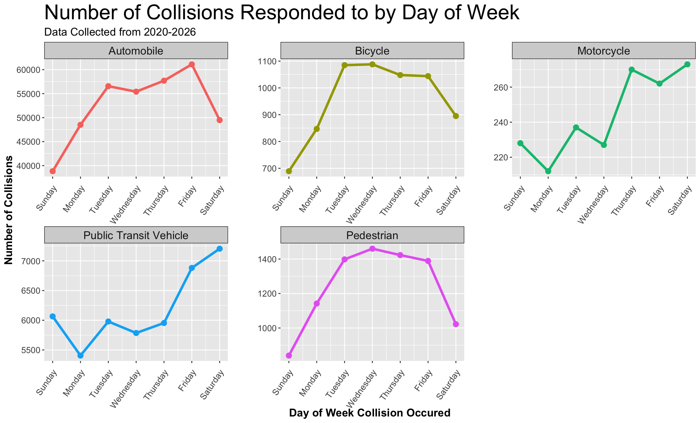
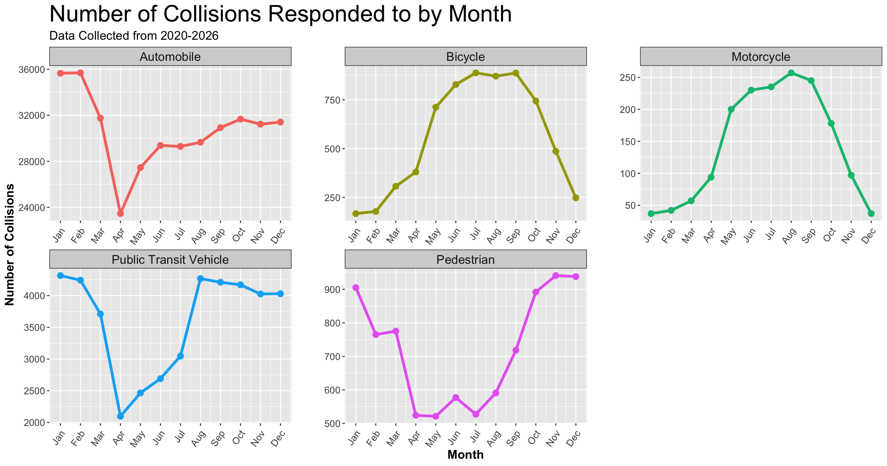

## Introduction

Why is traffic system important?

- Economic and social impacts
- Urban areas face increasing collision risks
- Data-driven analysis supports evidence-based planning

## Motivation

What temporal and spatial patterns exist in Toronto traffic collisions, and how do collision risks vary across different travel modes?

- Study on Wujiang, China [@cite-wujiang] discovered high-risk spot at the connection with a major city, which is associated with high traffic volumes, ongoing construction projects, and high proportion of large trucks.
- Scientists in Iran [@cite-forecast] conducted a time series analysis in Zanjan Province for predicting the future morality in traffic, and the models shows a descending trend in traffic morality, associated with stricter traffic enforcement and education as time passed.
- Investigation on Toronto collision patterns supports evidence-based transportation planning and resource allocation

# Data & Methods

## Data Source & Structure

- The Toronto Police Service maintains data on traffic collisions they are called to respond to
- This data includes attributes such as:
  - **Month**, **Weekday**, and **Hour** when the collision took place
  - **Neighbourhood** where the collision took place
  - Binaries for whether five different types of vehicle were involved in the collision
    - These include **Automobile**, **Passenger Vehicle (public transportation)**, **Motorcycle**, **Bicycle**, and **Pedestrian**
- Data collected between 2020 and 2026 was sourced from [@cite-tpsdata]

## Data Cleaning & Pre-Processing

- R [@cite-R] and the janitor package [@cite-janitor] were used to clean the data and optimize it for analysis
- Several columns were renamed using more semantic language
  - e.g. *"FTR_COLLISIONS"* renamed to *"FAILURE_TO_REMAIN"*
- All-capitals column names standardized to snake_case using janitor's clean_names() function
- Columns added for month_number (1-12, January - December) and dow_number (1-7, Sunday - Saturday) to simplify ordered temporal visualizations

## Methods: Exploratory Data Analysis

This project used the R programming language [@cite-R] and the tidyverse library [@cite-tidyverse] to do reproducible data analysis. High level steps included:

- Looking at the temporal, spatial, and vehicle type columns using `unique()` to check that all values make sense for the type of data being reported
  - e.g. making sure that all values in the *occ_month* column contain month names, spelled correctly and consistently stylized
- Using `group_by()` and `mutate()` to calculate the percentage of total collisions that happened in a given time frame or neighbourhood
- Using the `pivot_longer()` function to melt the vehicle type columns from the original dataframe into one column containing vehicle type (*vehicle_type*) and another containing the binary cell values (*involved_yesno*)
  - This long dataframe was then filtered to only rows with *"YES"* in the involved_yesno column
  - This changes the observational unit from individual collisions to individual vehicles involved in collisions, with five rows per collision

## Methods: Data Visualization

Statistical visuals and summary tables were generated using the *ggplot2* library from [@cite-tidyverse], the patchwork library [@cite-patchwork] for concatenated figures, and kableExtra [@cite-kableExtra] for clean tables.

- Line graphs help to understand temporal trends in collision frequency
- Summary tables help to understand the most prominent spatial and temporal hotspots

## Methods: Statistical Modeling

- Linear regression of the form $y = \beta_0 + \beta_1 x_1 + ... + \beta_n x_n + \varepsilon$ was used to better understand the relationship between variables 
- Temporal, spatial, and vehicle type variables were used as predictors, with collision frequency as the goal outcome variable
- This took the following form in `R` syntax:

```{r}
#| eval: false
#| echo: true
model <- lm(y ~ x_1 + ... + x_n, data = tps_collisions)
```
  
# Results

## Spatial & Summary Trends

- Wexford/Maryvale is a spatial hotspot for collisions
- Temporal variation observed in collision frequency for different vehicle types

{fig-align="center"}

## Hourly Trends

- Similar across all vehicle types
- Overnight collisions are low, with a sharp increase between **05:00** and **09:00**
- Daily peak between **15:00** and **18:00**

{fig-align="center"}

## Weekly Trends

- <span style="color:#C4BC00;">Bicycles</span> and <span style="color:#EA6AFF;">pedestrians</span> experience peak collisions in the middle of the week
- <span style="color:#F8766D;">Automobiles</span> experience a steady increase throughout the week, a sharp peak on Friday, and then a sharp decrease during the weekend
- Friday and Saturday are peak days for both <span style="color:#00C094;">motorcycles</span> and <span style="color:#00B6EB;">public transit</span>

{fig-align="center"}

## Monthly Trends

- For <span style="color:#C4BC00;">bicycles</span> and <span style="color:#00C094;">motorcycles</span>, most collisions occur between April and May
- For <span style="color:#F8766D;">automobiles</span>, <span style="color:#EA6AFF;">pedestrians</span>, and <span style="color:#00B6EB;">public transit vehicles</span>, collisions are at a yearly high towards the extremes of the year

{fig-align="center"}

## Modeling Results: R^2^

The first model, `overall_model`, was run using neighbourhood, hour, day-of-week, month, and vehicle type as predictors, with number of collisions as the outcome variable:

```{r}
#| eval: false
#| echo: true

overall_model <- lm(number_of_collisions ~ neighbourhood + occ_month + occ_dow + 
                      occ_hour + vehicle_type, data = overall_collisions)
```

- The $R^2$ value for this model is **0.3241**.\n\n 

The second model, `minus_vt_model`, was run to investigate if model performance would improve if vehicle type were removed as a predictor:

```{r}
#| eval: false
#| echo: true

minus_vt_model <- lm(number_of_collisions ~ neighbourhood + occ_month + occ_dow 
                     + occ_hour, data = overall_collisions_minus_vt)
```

- The $R^2$ value for this model is **0.5806**.

## Modeling Results: Residuals 

To evaluate the models and how well they fit the data side-by-side, the residual errors from both models were plotted versus their respective predictions. 

{fig-align="center"}

# Discussion

## Findings

- We can temporally and spatially model collision risk, similar to prior research
  - Data science on collision risk can help prevention measure development
- We do see variation in collision risk trends for different vehicle types
- All modes of transportation experience sharp increases in collision frequencies during the morning rush hour, and hit their peaks during the afternoon rush hour
- More accidents occur during the week, when people are commuting
- More accidents for year-round transit modes like automobiles and public transit vehicles happen during the winter
  - Bicycles and motorcycles, which are used less frequently during the winter, record far more collisions over the summer
- While spatial and temporal trends can be observed visually, they are not particularly well-correlated
  - Residuals are centered around zero, but have observable patterns and a non-constant spread
  - Removing vehicle type to the model nearly doubled the R^2^

## Limitations

- Predominantly automobile collisions recorded
  - Over 350,000 automobile collisions were recorded, while public transit vehicles were under 50,000, and other modes of transportation did not even break 10,000
  - Even if vehicle type were an accurate predictor of accident frequency, fitting a model with vehicle type as a predictor would be challenging
- Using data collected by a police service
  - Only collisions severe enough to warrant the police responding to the scene are recorded
  - Involved parties might have any number of reasons for not wanting to involve the police

## Conclusion

Key Takeaways

- Traffic collisions in Toronto exhibit clear temporal and seasonal patterns, with risks varying by travel mode.
- Recent TPS data can effectively identify collision trends and high-risk periods.

Future Research
- Incorporate additional variables such as weather and land use to improve explanatory power.
- Explore more advanced spatial and spatiotemporal models to better capture collision hotspots.
- Extend the analysis with additional years of data to evaluate long-term trends and the impact of future transportation policies.

## References

::: {#refs}
:::
